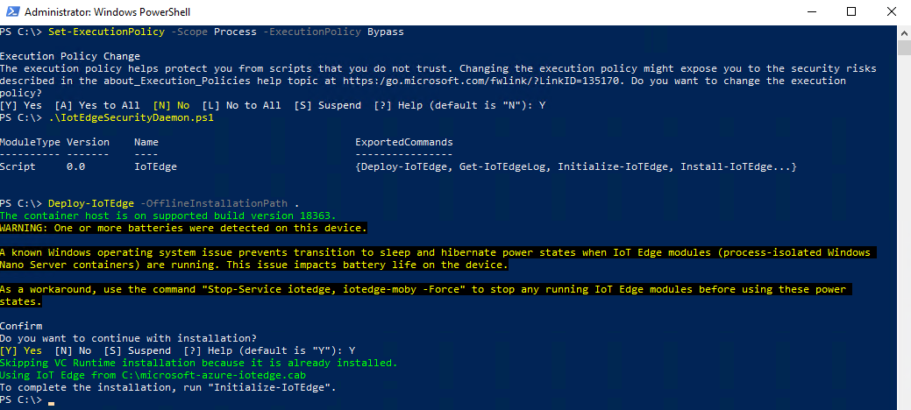

# Azure IoT Edge Modbus Module GA #


## Getting started ##
* Try out this Azure IoT Edge solution with `Modbus TCP/RTU` connectivity.
* IoT Edge Modbus module allows you to read data from Modbus devices and publish data to the Azure IoT Hub.


Find more information about <a href="https://docs.microsoft.com/en-us/azure/iot-edge/" target="_blank">Azure IoT Edge</a>


## Azure IoT Edge Compatibility ##
* Current version of the module is targeted for the <a href="https://azure.microsoft.com/en-us/blog/azure-iot-edge-generally-available-for-enterprise-grade-scaled-deployments/" target="_blank">Azure IoT Edge GA</a>
* If you are using <a href="https://github.com/Azure/iot-edge/tree/master/v1" target="_blank">v1 version of IoT Edge</a> (previously known as Azure IoT Gateway),

  please use v1 version of this module, all materials can be found in <a href="https://github.com/Azure/iot-edge-modbus/tree/master/v1" target="_blank">v1</a> folder.


## Platform Compatibility ##
Azure IoT Edge Modbus module has been tested on the following platforms:

|Platform|OS Info|Modbus TCP|Modbus RTU|
|:--------------------:|:-----------------------------------:|:--------:|:--------:|
|Windows x64           |Window 10 Enterprise 1909 (18363)    |V         |V         |
|Windows ARM32v7       |Window 10 IoT Core (17763)           |V         |*         |
|Linux x64             |Ubuntu 16.04                         |V         |V         |
|Linux ARM32v7         |Yocto (sumo)                         |V         |V         |

`* Modbus RTU connectivity is not yet verified on Windows ARM32v7 platform`


## Prepare target IoT Edge devices ##
* `Windows x64 (AMD64) Platform`
  * Prerequisites:
    * <a href="https://docs.microsoft.com/en-us/azure/iot-edge/how-to-install-iot-edge-windows#offline-or-specific-version-installation" target="_blank">Install the Azure IoT Edge runtime on Windows</a>
    * Ensure your target device Windows OS version is supported to run Windows Containers
      ```Bash
      # Admin@PowerShell
      # Get IoTEdgeSecurityDaemon.ps1 and Microsoft-Azure-IoTEdge.cab
      # from https://github.com/Azure/azure-iotedge/releases/tag/1.0.8

      > Get-CimInstance Win32_OperatingSystem | Select-Object Version
      > .\IotEdgeSecurityDaemon.ps1
      > Deploy-IoTEdge -OfflineInstallationPath .
      ```
      

       If not, go to next [step](#avps) to modify PowerShell script
   * (Option) Add `supported Windows OS for running Windows Containers` in `PowerShell script` <a name="avps"></a>
      ```Bash
      Set-Variable Windows1909 -Value 18363 -Option Constant
      #Set-Variable SupportedBuildsForWindowsContainers -Value @($Windows1809)
      Set-Variable SupportedBuildsForWindowsContainers -Value @($Windows1909)
      ```
      

  * <a href="https://docs.microsoft.com/en-us/azure/iot-edge/how-to-install-iot-edge-windows#option-1-install-and-manually-provision" target="_blank">Configure the IoT Edge Security Daemon with manual provisioning</a>
    * (Option) Set the script execution policies to `Bypass` if necessary
      ```Bash
      # Admin@PowerShell
      > Set-ExecutionPolicy -Scope Process -ExecutionPolicy Bypass
      ```

      


* `Windows ARM32v7 Platform`
    * Prerequisites:
        * <a href="https://docs.microsoft.com/en-us/windows/iot-core/tutorials/quickstarter/devicesetup#using-the-iot-dashboard-raspberry-pi-minnowboard-nxp" target="_blank">Using the `Windows IoT Core Dashboard` to setup Raspberry Pi</a>

        * <a href="https://docs.microsoft.com/en-us/windows/iot-core/connect-your-device/powershell" target="_blank">Remotely configure and manage your Windows 10 IoT Core device by using Windows PowerShell</a>
           ```Bash
           # Admin@PowerShell
           > net start WinRM
           > Set-Item WSMan:\localhost\Client\TrustedHosts -Value <machine1-name or IP Address>
           > Enter-PSSession -ComputerName <machine-name or IP Address> -Credential <machine-name or IP Address or localhost>\Administrator
           ```

    * <a href="https://docs.microsoft.com/en-us/azure/iot-edge/how-to-install-iot-edge-windows#option-1-install-and-manually-provision" target="_blank">Configure the IoT Edge Security Daemon with manual provisioning</a>


 * `Linux x64 (AMD64) Platform`
   * Prerequisites:
       *  <a href="https://releases.ubuntu.com/16.04/" target="_blank">Ubuntu_v16.04</a> -  <a href="https://ubuntu.com/tutorials/tutorial-install-ubuntu-desktop-1604#1-overview" target="_blank">Install Ubuntu 16.04 desktop</a>

       * <a href="https://docs.microsoft.com/en-us/azure/iot-edge/how-to-install-iot-edge-linux#install-a-specific-runtime-version" target="_blank">Install the specific Azure IoT Edge runtime on Debian-based Linux systems</a>
          ```Bash
          # superuser@terminal
          # https://github.com/Azure/azure-iotedge/releases/tag/1.0.8

          # Install Alien
          $ sudo apt-get install alien

          # Install  moby-engine and moby-cli RPM files
          $ sudo alien -i moby-engine-3.0.6-centos.x86_64.rpm
          $ sudo alien -i moby-cli-3.0.6-centos.x86_64.rpm

          # Install IoT Edge security daemon and the hsmlib
          $ sudo dpkg -i libiothsm-std_1.0.8-2_amd64.deb
          $ sudo dpkg -i iotedge_1.0.8-2_amd64.deb
          ```

   * <a href="https://docs.microsoft.com/en-us/azure/iot-edge/how-to-install-iot-edge-linux#configure-the-security-daemon" target="_blank">Configure the IoT Edge Security Daemon with manual provisioning</a>

     * Update the value of `device_connection_string` with the connection string from your IoT Edge device


* `Linux ARM32v7 Platform`
  * Prerequisites:
    * <a href="https://projects.raspberrypi.org/en/pathways/getting-started-with-raspberry-pi" target="_blank">Get started with Raspberry Pi</a>

    * Create Yocto Project with <a href="https://meta-raspberrypi.readthedocs.io/en/latest/readme.html" target="_blank">meta-raspberrypi</a> and <a href="https://github.com/Azure/meta-iotedge" target="_blank">meta-iotedge</a> for Raspberry Pi

  * <a href="https://docs.microsoft.com/en-us/azure/iot-edge/how-to-install-iot-edge-linux#configure-the-security-daemon" target="_blank">Configure the IoT Edge Security Daemon with manual provisioning</a>
    * Update the value of `device_connection_string` with the connection string from your IoT Edge device
    * Update the value of `hostname` with the current hostname in your target device
      ```Bash
      # Setup device_connection_string and hostname in config.yaml
      device_connection_string: "<ADD DEVICE CONNECTION STRING HERE>"
      hostname: "<ADD HOSTNAME HERE>"
      ```


## Setup the build environment ##

Reference: <a href="https://docs.microsoft.com/en-us/azure/iot-edge/tutorial-csharp-module-windows" target="_blank">Develop a C# IoT Edge module for Windows devices</a>

  * Create Azure Cloud resources <a name="cacr"></a>
    * <a href="https://docs.microsoft.com/en-us/azure/iot-hub/quickstart-send-telemetry-dotnet#create-an-iot-hub" target="_blank">Create an `IoT Hub`</a>
    * <a href="https://docs.microsoft.com/en-us/azure/iot-edge/quickstart#register-an-iot-edge-device" target="_blank">Register an `IoT Edge device` to your IoT hub</a>
    * <a href="https://docs.microsoft.com/en-us/azure/iot-edge/tutorial-develop-for-windows#create-a-container-registry" target="_blank">Create a `Container Registry`</a>   
  * `Clone the` <a href="https://github.com/Azure/iot-edge-modbus.git" target="_blank">iot-edge-modbus</a> `source code from official site`
  * `Install` <a href="https://code.visualstudio.com/Download" target="_blank">Visual Studio Code</a> `configured with the needed extensions:`

       * <a href="https://marketplace.visualstudio.com/items?itemName=vsciot-vscode.azure-iot-tools" target="_blank">`Azure IoT Tools extension packs`</a>
       * <a href="https://marketplace.visualstudio.com/items?itemName=ms-vscode.azure-account" target="_blank">`Azure Account extension`</a>
       * <a href="https://marketplace.visualstudio.com/items?itemName=ms-dotnettools.csharp" target="_blank">`C# for Visual Studio Code (powered by OmniSharp) extension`</a>
       * <a href="https://marketplace.visualstudio.com/items?itemName=ms-azuretools.vscode-docker" target="_blank">`Docker extension`</a>


  * <a href="https://docs.docker.com/docker-for-windows/#switch-between-windows-and-linux-containers" target="_blank">Install `Docker CE` configured to run Linux or Windows containers</a>

  * Initialize IoT Edge Modbus project with Visual Studio Code
    * Open the folder `iotedgeModbus` in `iot-edge-modbus` Project that you just cloned

    * Create a `.env` file and add your `registry credentials` info (Path: `iot-edge-modbus\iotedgeModbus\.env`)

    *  Add your `registry credentials` to `deployment.template.json` after [creating Azure Cloud resources](#cacr)

  * Set `SlaveConnection` in `deployment.template.json`

    `Examples of SlaveConnection`:

    |SlaveConnection | Connectivity |Note|
    |:--------------:|:------------:|:--------------------:|
    |10.102.55.32    |Modbus TCP    |IPV4 address          |
    |aka.ms          |Modbus TCP    |Hostname              |
    |COM3            |Modbus RTU    |SerialPortName in Windows based platform|
    |/dev/ttyUSB0    |Modbus RTU    |SerialPortName in Linux based platform  |

    `deployment.template.json`:
    ```JSON
    "modbus": {  
        "properties.desired":{
          "PublishInterval": "5000",
          "Version":"2",
          "SlaveConfigs": {
            "Slave01": {
              "SlaveConnection": "<IPV4 address or Hostname>",
              "TcpPort": "502",
              "RetryCount": "10",
              "RetryInterval": "100",
              "HwId": "PowerMeter-0a:01:01:01:01:01",
              "Operations": {
                "Op01": {
                  "PollingInterval": "2000",
                  "UnitId": "1",
                  "StartAddress": "400001",
                  "Count": "2",
                  "CorrelationId": "MessageType1",
                  "DisplayName": "Voltage"
                },
                "Op02": {
                  "PollingInterval": "2000",
                  "UnitId": "1",
                  "StartAddress": "400002",
                  "Count": "2",
                  "CorrelationId": "MessageType2",
                  "DisplayName": "Current"
                }
              }
            },
            "Slave02": {
              "SlaveConnection": "<SerialPortName>",
              "RetryCount": "10",
              "RetryInterval": "50",
              "HwId": "PowerMeter-0a:01:01:01:01:02",
              "BaudRate": "9600",
              "DataBits": "8",
              "StopBits": "1",
              "Parity": "None",
              "FlowControl": "NONE",
              "Operations": {
                "Op01": {
                  "PollingInterval": "1000",
                  "UnitId": "1",
                  "StartAddress": "30001",
                  "Count": "1",
                  "CorrelationId": "MessageType1",
                  "DisplayName": "CO2"
                },
                "Op02": {
                  "PollingInterval": "1000",
                  "UnitId": "1",
                  "StartAddress": "30002",
                  "Count": "1",
                  "CorrelationId": "MessageType1",
                  "DisplayName": "Humidity"
                }
              }
            }
          }
        }
      }
    ```
   * Definition of each field of the above modbus table:

     ```
     * "PublishInterval"         - Interval between each push to IoT Hub in millisecond.
     * "Version"                 - Switch between the PP (Public Preview) and the latest Message Payload format.
                                   (PP: "1", latest format: "All other values")
     * "SlaveConfigs"            - Contains one or more Modbus slaves' configuration.
         * "Slave01", "Slave02"  - User defined the different names for each Modbus slave.
         * "SlaveConnection"     - Ipv4 address or the serial port name of the Modbus slave.
         * "RetryCount"          - Max retry attempt for reading data, default to 10.
         * "RetryInterval"       - Retry interval between each retry attempt. (Default: 50 milliseconds)
         * "HwId"                - Unique Id for each Modbus slave. (User defined)
         * "BaudRate"            - Serial port communication parameter.
         * "DataBits"            - Serial port communication parameter.
         * "StopBits"            - Serial port communication parameter.
         * "Parity"              - Serial port communication parameter.
         * "FlowControl"         - Serial port communication parameter.
         (Ref: https://en.wikipedia.org/wiki/Serial_port#Settings)

         * "Operations"          - Contains one or more Modbus read requests. 
                                   In this sample, we have "Op01" and "Op02" read requests in both Slave01 and Slave02:
             * "Op01", "Op02"    - User defined names for each read request, cannot have duplicates under the same "Operations" section.
             * "PollingInterval" - Interval between each read request in millisecond
             * "UnitId"          - The unit id to be read.
             * "StartAddress"    - The starting address of Modbus read request, currently supports both 5-digit and 6-digit [format].
             * "Count"           - Number of registers/bits to be read.
             * "DisplayName"     - Alternative name for the "StartAddress" register(s)(user defined).
             * "CorrelationId"   - The Operations with same id with be grouped together in their output message.
      ```

  * (Option) Add serial device mapping of `createOptions` in `deployment.template.json` for `Modbus RTU connectivity`:
    * Target IoT Edge device of `Windows based platform`:
       ```JSON
       "modules": {
            "modbus": {
              "version": "1.0",
              "type": "docker",
              "status": "running",
              "restartPolicy": "always",
              "settings": {
                "image": "${MODULES.iotedgeModbus.windows-amd64}",
                "createOptions": {
                  "HostConfig": {
                    "Devices": [
                        {
                            "PathOnHost": "class/86e0d1e0-8089-11d0-9ce4-08003e301f73",
                            "PathInContainer": ""
                        }
                    ],
                    "Isolation": "Process"
                  }
                }
              }
            }
          }
       ```
       Reference: [Devices in Containers on Windows](https://docs.microsoft.com/en-us/virtualization/windowscontainers/deploy-containers/hardware-devices-in-containers)

      * Find out the correct `serial port name` via Device Manager :
        

        In this case, the `SlaveConnection` in "Slave02" of deployment.template.json should be `COM3`  


    * Target IoT Edge device of `Linux based platform`:
       ```JSON
       "modules": {
            "modbus": {
              "version": "1.0",
              "type": "docker",
              "status": "running",
              "restartPolicy": "always",
              "settings": {
                "image": "${MODULES.iotedgeModbus.amd64}",
                "createOptions": {
                  "HostConfig": {
                    "Devices": [
                        {
                            "PathOnHost": "/dev/ttyUSB0",
                            "PathInContainer": "/dev/ttyUSB0",
                            "CgroupPermissions": "rwm"
                        }
                    ]
                  }
                }
              }
            }
          }
       ```
      * Find out the corresponding device node that attached to your serial device
      
  
        In this case, the SlaveConnection in "Slave02" of deployment.template.json should be `/dev/ttyUSB0`


  * Add repository and version info to  `module.json` for your needs:

    ```JSON
    {
      "$schema-version": "0.0.1",
      "description": "",
      "image": {
          "repository": "myregistry.azurecr.io/modbus",
          "tag": {
              "version": "1.0.8",
              "platforms": {
                  "amd64": "./Dockerfile.amd64",
                  "amd64.debug": "./Dockerfile.amd64.debug",
                  "arm32v7": "./Dockerfile.arm32v7",
                  "windows-amd64": "./Dockerfile.windows-amd64",
                  "windows-arm32v7": "./Dockerfile.windows-arm32v7"
              }
          },
          "buildOptions": []
        },
        "language": "csharp"
    }
    ```

  * Select your target architecture

     
     ```Bash
     View > Command Palette
     Entry "Azure IoT Edge: Set Default Target Platform for Edge Solution"
     Choose the target architecture

     |-------Platform-------|--Select IoT Edge Default Platform--|
     |AMD64                 |amd64                               |
     |ARM32v7               |arm32v7                             |
     |Windows ARM32v7       |arm32v7                             |
     |Windows AMD64         |windows-amd64                       |
     ```

  * <a href="https://docs.microsoft.com/en-us/azure/iot-edge/tutorial-csharp-module#build-and-push-your-module" target="_blank">Build and push your module to Azure container registry</a>


## Module Endpoints and Routing ##
There are two endpoints defined in Modbus TCP module:  
* `modbusOutput` : This is a output endpoint for telemetries. All read operations defined in configuration will be composed as telemetry messages output to this endpoint.
* `input1` : This is an input endpoint for write commands.

### Read from Modbus (Output) ###

#### Telemetry Message ####
Message Properties:
```json
"content-type": "application/edge-modbus-json"
```
Latest Message Payload:
```json
[
    {
      "PublishTimestamp": "2018-04-17 12:28:53",
      "Content": [
        {
          "HwId": "PowerMeter-0a:01:01:01:01:02",
          "Data": [
            {
              "CorrelationId": "MessageType1",
              "SourceTimestamp": "2018-04-17 12:28:48",
              "Values": [
                {
                  "DisplayName": "Op02",
                  "Address": "40003",
                  "Value": "2785"
                },
                {
                  "DisplayName": "Op02",
                  "Address": "40004",
                  "Value": "18529"
                },
                {
                  "DisplayName": "Op01",
                  "Address": "40001",
                  "Value": "1840"
                },
                {
                  "DisplayName": "Op01",
                  "Address": "40002",
                  "Value": "31497"
                }
              ]
            },
            {
              "CorrelationId": "MessageType1",
              "SourceTimestamp": "2018-04-17 12:28:50",
              "Values": [
                {
                  "DisplayName": "Op02",
                  "Address": "40003",
                  "Value": "21578"
                },
                {
                  "DisplayName": "Op02",
                  "Address": "40004",
                  "Value": "26979"
                },
                {
                  "DisplayName": "Op01",
                  "Address": "40001",
                  "Value": "13210"
                },
                {
                  "DisplayName": "Op01",
                  "Address": "40002",
                  "Value": "13549"
                }
              ]
            }
          ]
        }
      ]
    }
  ]
```
PP (Public Preview) Message Payload:
```json
[
	{
		"DisplayName":"RotaryOne",
		"HwId":"Wise4012E",
		"Address":"40001",
		"Value":"0",
		"SourceTimestamp":"2018-09-18 04:14:32"
	},
	{
		"DisplayName":"SwitchOne",
		"HwId":"Wise4012E",
		"Address":"00001",
		"Value":"1",
		"SourceTimestamp":"2018-09-18 04:14:33"
	},
	{
		"DisplayName":"RelayOne",
		"HwId":"Wise4012E",
		"Address":"00017",
		"Value":"0",
		"SourceTimestamp":"2018-09-18 04:14:33"
	}
]
```

#### Route to IoT Hub ####
```json
{
  "routes": {
    "modbusToIoTHub":"FROM /messages/modules/modbus/outputs/modbusOutput INTO $upstream"
  }
}
```

#### Route to other (filter) modules ####
```json
{
  "routes": {
    "modbusToFilter":"FROM /messages/modules/modbus/outputs/modbusOutput INTO BrokeredEndpoint(\"/modules/filtermodule/inputs/input1\")"
  }
}
```
Reference: <a href="https://docs.microsoft.com/en-us/azure/iot-edge/module-composition#declare-routes" target="_blank">Declare routes in edgehub</a>

### Write to Modbus (Input) ###
Modbus module use input endpoint "input1" to receive commands. Currently it supports writing back to a single register/cell in a Modbus slave.  
***Note: Currently IoT Edge only supports send messages into one module from another module, direct C2D messages doesn't work.***

#### Command Message ####
The content of command must be the following message format.  

Message Properties:
```json
"command-type": "ModbusWrite"
```

Message Payload:
```json
{
  "HwId":"PowerMeter-0a:01:01:01:01:01",
  "UId":"1",
  "Address":"40001",
  "Value":"15"
}
```

#### Route from other (filter) modules ####
The command should have a property "command-type" with value "ModbusWrite". Also, routing must be enabled by specifying rule like below.
```json
{
  "routes": {
    "filterToModbus":"FROM /messages/modules/filtermodule/outputs/output1 INTO BrokeredEndpoint(\"/modules/modbus/inputs/input1\")"
  }
}
```

## Deploy Modbus module to your target device ##
* <a href="https://docs.microsoft.com/en-us/azure/iot-edge/how-to-deploy-modules-vscode#deploy-to-your-device" target="_blank">`Deploy Modbus modules from Visual Studio Code`</a>


## Contributing
This project welcomes contributions and suggestions. Most contributions require you to agree to a Contributor License Agreement (CLA) declaring that you have the right to, and actually do, grant us the rights to use your contribution. For details, visit
https://cla.microsoft.com.

When you submit a pull request, a CLA-bot will automatically determine whether you need to provide a CLA and decorate the PR appropriately (e.g., label, comment). Simply follow the instructions provided by the bot. You will only need to do this once across all repositories using our CLA.

This project has adopted the [Microsoft Open Source Code of Conduct](https://opensource.microsoft.com/codeofconduct/). For more information see the [Code of Conduct FAQ](https://opensource.microsoft.com/codeofconduct/faq/) or contact [opencode@microsoft.com](mailto:opencode@microsoft.com) with any additional questions or comments.
